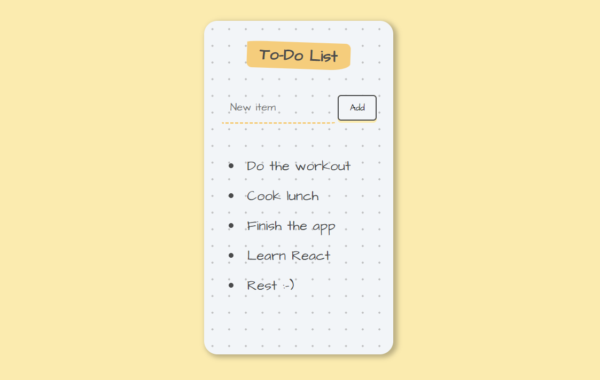

# To-Do App

- A small project created with React as part of the Complete 2022 Web Development Bootcamp with [The App Brewery](https://www.appbrewery.co/)
- To do item can be added to the bullet point list by typing in the input box and clicking on the 'Add' button and then removed by clicking on it

